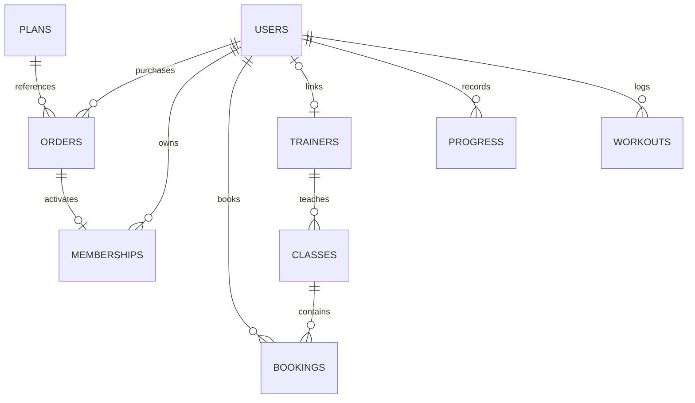

# Gym TN — Mạnh hơn mỗi ngày

Website quản lý phòng gym với giao diện tiếng Việt: **React + Vite + Tailwind CSS**, **Python Flask**, **SQLite**. Dữ liệu được lưu trong SQLite, frontend gọi API thật; không dùng dữ liệu giả trong localStorage để thay backend.

## Chạy nhanh trên Windows

Mở PowerShell tại thư mục dự án:

```powershell
powershell -ExecutionPolicy Bypass -File .\start.ps1 -Setup -SeedDemo
```

Mở **http://127.0.0.1:5173**. Giữ terminal đang chạy; nhấn `Ctrl+C` để dừng. Script cài thư viện vào `.venv`, cài frontend bằng lockfile, tạo dữ liệu mẫu nếu có `-SeedDemo`, rồi chạy cả Flask và Vite. Script kiểm tra cổng 5000/5173 **trước khi cài thư viện**; nếu cổng đang được sử dụng, script báo lỗi và không thay đổi thư viện hay dừng ứng dụng đó.

Các lần sau:

```powershell
powershell -ExecutionPolicy Bypass -File "./start.ps1"
```


Không cần dùng `-Setup -SeedDemo` mỗi lần mở website. Nếu website đang chạy, mở đường dẫn trên; để chạy lại hoặc cài lại, dừng terminal đang chạy bằng `Ctrl+C` trước.

### Lỗi EPERM / unlink lightningcss trên Windows

File `lightningcss.win32-x64-msvc.node` có thể đang được Vite sử dụng. `npm ci` trong bước `-Setup` thay thế thư mục thư viện nên không thể xóa file đang bị khóa.

1. Dừng các terminal đang chạy **Gym TN** bằng `Ctrl+C`, gồm Vite và Flask. Không cần dừng các ứng dụng Node/Python khác.
2. Chạy lại `powershell -ExecutionPolicy Bypass -File .\start.ps1 -Setup`. Lệnh này khôi phục thư viện nếu lần cài trước bị gián đoạn, không xóa dữ liệu SQLite.
3. Những lần sau chỉ chạy `powershell -ExecutionPolicy Bypass -File .\start.ps1`.

`Requirement already satisfied` là thông báo thư viện Python đã được cài. `(.venv)` cho biết môi trường Python đang được kích hoạt; cả hai đều không phải lỗi.

Yêu cầu: Node.js 22.12+ hoặc 24 LTS, Python 3.11+. Script có thể dùng Python đi kèm môi trường Codex nếu máy chưa thêm Python vào PATH. Khi chuyển sang máy khác, cài Python và Node.js rồi chạy lại thiết lập; không sao chép `.venv` hoặc `node_modules` giữa các máy.

### Tài khoản mẫu

Chỉ được tạo khi chạy lệnh `seed` hoặc tùy chọn `-SeedDemo`:

| Vai trò | Email | Mật khẩu |
| --- | --- | --- |
| Quản trị viên | `admin@gymtn.vn` | `Admin@12345` |
| Hội viên | `member@gymtn.vn` | `Member@12345` |

Hội viên mẫu có gói 30 ngày đã kích hoạt, 4 lần ghi chỉ số và 3 buổi tập. Dữ liệu gồm 3 gói tập, 3 huấn luyện viên, 42 lớp trong 14 ngày tiếp theo và 3 bài viết. Lệnh seed chạy lại không ghi đè dữ liệu đã chỉnh sửa, không đổi mật khẩu và không làm mới lịch đã hết hạn. Tạo lịch mới trong quản trị khi cần.

### Khu vực quản trị riêng

- **Đăng nhập admin:** http://127.0.0.1:5173/quan-tri/dang-nhap
- **Dashboard admin:** http://127.0.0.1:5173/quan-tri
- **Đăng nhập hội viên / HLV:** http://127.0.0.1:5173/dang-nhap
- **Khu vực HLV:** http://127.0.0.1:5173/hlv

Admin sử dụng giao diện quản lý riêng gồm sidebar, thanh tài khoản, dashboard và các màn hình nghiệp vụ. Cổng admin chỉ chấp nhận tài khoản có vai trò `admin`; người dùng tự đăng ký luôn là hội viên. Các tài khoản dùng chung cơ chế phiên, nên mỗi trình duyệt duy trì một tài khoản đăng nhập tại một thời điểm. Dùng cửa sổ riêng tư hoặc trình duyệt khác nếu muốn thử đồng thời admin và hội viên.

Đăng nhập bằng tài khoản admin ở bảng trên, chọn **Quản lý tài khoản → Tạo tài khoản** để tạo hội viên hoặc HLV, chỉnh thông tin, phân quyền, khóa/mở tài khoản và đặt mật khẩu mới. Với chính tài khoản admin đang dùng, chọn **Tài khoản của tôi** để sửa hồ sơ hoặc đổi mật khẩu.

Tạo tài khoản huấn luyện viên:

1. Vào **Huấn luyện viên**, tạo hồ sơ nếu chưa có.
2. Bấm **Tạo tài khoản** trên dòng hồ sơ đó, nhập email và mật khẩu khởi tạo. Mỗi hồ sơ gắn với tối đa một tài khoản HLV.
3. HLV dùng email/mật khẩu được cấp để đăng nhập ở `/dang-nhap`; website đưa đến `/hlv`.
4. HLV xem lịch được giao, danh sách hội viên và điểm danh sau khi lớp bắt đầu. HLV không có quyền xem doanh thu hoặc quản lý tài khoản khác.

Ẩn hồ sơ HLV khỏi website và khóa tài khoản đăng nhập là hai trạng thái riêng. Để ngừng quyền truy cập của HLV, khóa tài khoản tại **Quản lý tài khoản**. Tài khoản HLV được admin tạo theo nhu cầu; lệnh seed không tự thêm tài khoản HLV với mật khẩu mặc định.

Sau khi cập nhật code, dừng terminal cũ bằng `Ctrl+C` rồi chạy lại `start.ps1` (không cần `-Setup`). Backend tự nâng cấp SQLite sang cấu trúc hỗ trợ tài khoản HLV; giữ nguyên ID, mật khẩu, đơn hàng, lịch lớp và dữ liệu hội viên.

## Các chức năng đã triển khai

### Khách truy cập

- Trang chủ, giới thiệu dịch vụ, quyền lợi và câu hỏi thường gặp.
- Xem gói tập và đăng ký mua gói sau khi đăng nhập.
- Xem lịch lớp, lọc theo bộ môn/ngày, tìm tên lớp hoặc huấn luyện viên.
- Danh sách huấn luyện viên và gửi yêu cầu tư vấn PT.
- Tìm bài viết, đọc chi tiết, trang điều khoản và bảo mật.
- Gửi yêu cầu liên hệ vào cơ sở dữ liệu.
- Đăng ký, đăng nhập, đăng xuất; thông báo lỗi và trạng thái tải.

### Hội viên

- Tổng quan gói hiệu lực, lớp sắp diễn ra, số buổi và phút tập đã ghi.
- Tạo đơn theo gói tập, chọn thanh toán tại quầy hoặc mô phỏng nếu được bật.
- Thanh toán mô phỏng có bước xác nhận rõ ràng, xem/hủy đơn đang chờ.
- Xem thẻ hội viên, lịch sử gia hạn, phiếu đơn hàng và in/lưu PDF qua trình duyệt.
- Đặt lớp khi có gói hiệu lực vào thời điểm lớp diễn ra; kiểm tra lớp đầy và trùng lịch.
- Hủy đặt lớp trước khi bắt đầu; đặt lại sau khi hủy nếu còn chỗ.
- Xem trạng thái lớp bị quản trị viên hủy, trạng thái điểm danh.
- Ghi/xóa nhật ký tập: ngày, tên, thời lượng, ghi chú.
- Ghi/xóa chỉ số chiều cao, cân nặng; biểu đồ, lịch sử và BMI tính từ số nhập.
- Cập nhật hồ sơ, đổi mật khẩu; đổi mật khẩu vô hiệu hóa các phiên khác.

### Quản trị viên

- Trang đăng nhập và giao diện quản trị tách khỏi giao diện khách; có menu riêng, đăng xuất và hồ sơ admin.
- Dashboard số hội viên, số gói hiệu lực, doanh thu đã xác nhận, đơn chờ và yêu cầu mới.
- Doanh thu theo tháng, danh sách đơn hàng gần đây.
- Tạo/sửa tài khoản hội viên, HLV và admin; sửa email/điện thoại, đặt mật khẩu mới, phân quyền, khóa/mở tài khoản. Không thể tự khóa hoặc tự hạ quyền.
- Thêm/sửa/ẩn gói tập, huấn luyện viên, bài viết; bật lại hiển thị qua chỉnh sửa.
- Thêm/sửa/hủy lớp; kiểm tra lịch trùng của phòng và huấn luyện viên.
- Không giảm sức chứa dưới số đã đặt hoặc đổi giờ/huấn luyện viên của lớp có người đặt.
- Xác nhận nhận tiền, kích hoạt gói tập; không thể xác nhận cùng đơn hai lần.
- Xem danh sách đặt lớp; điểm danh/bỏ điểm danh khi lớp đã bắt đầu.
- Xem lời nhắn tư vấn và chuyển trạng thái xử lý.
- Tìm kiếm, lọc trạng thái, phân trang, xuất CSV theo danh sách đang lọc. File CSV có UTF-8 BOM để Excel đọc tiếng Việt và chống ô công thức từ dữ liệu người dùng.

### Huấn luyện viên

- Tài khoản do admin tạo, liên kết với một hồ sơ HLV.
- Giao diện riêng cho lịch dạy, lớp đã bắt đầu, danh sách hội viên và điểm danh.
- Chỉ truy cập lớp được giao; cập nhật hồ sơ cá nhân và đổi mật khẩu.

## Cài đặt thủ công

### Backend — terminal thứ nhất

```powershell
py -3 -m venv .venv
.\.venv\Scripts\python.exe -m pip install -r backend\requirements.txt
Copy-Item backend\.env.example backend\.env
cd backend
..\.venv\Scripts\python.exe -m flask --app app seed
..\.venv\Scripts\python.exe app.py
```

Chỉ copy `.env.example` khi chưa có `.env` để không ghi đè cấu hình hiện tại. API chạy tại `http://127.0.0.1:5000/api`. Nếu `py` không có, dùng `python`.

### Frontend — terminal thứ hai

Tại thư mục gốc:

```powershell
npm --prefix frontend ci
npm run dev
```

Vite proxy `/api` sang Flask. Dùng nhất quán `127.0.0.1` hoặc `localhost` trong cùng phiên làm việc để cookie không bị tách theo hostname.

### Linux / macOS

```bash
python3 -m venv .venv
.venv/bin/python -m pip install -r backend/requirements.txt
cp backend/.env.example backend/.env
npm --prefix frontend ci
cd backend
../.venv/bin/python -m flask --app app seed
../.venv/bin/python app.py
```

Mở terminal khác ở thư mục gốc, chạy `npm run dev`.

## Quy trình chạy thử toàn bộ

1. Mở `/dang-ky`, tạo hội viên mới.
2. Vào `/goi-tap`, chọn gói và phương thức mô phỏng.
3. Vào `/hoi-vien?tab=orders`, bấm **Mô phỏng trả tiền**, xác nhận.
4. Vào `/lich-tap`, chọn lớp trong thời hạn gói rồi đặt chỗ.
5. Vào trang hội viên để xem hoặc hủy lịch; nhập nhật ký và chỉ số.
6. Tạo thêm đơn thanh toán tại quầy, đăng xuất, đăng nhập quản trị.
7. Vào `/quan-tri?tab=orders`, xác nhận đơn; xem doanh thu và dữ liệu quản lý.
8. Thử gửi yêu cầu tại `/lien-he`, xử lý tại `/quan-tri?tab=contacts`.

## Cấu trúc mã nguồn

```text
Gym TN/
├── start.ps1                 # Cài đặt và khởi động trên Windows
├── package.json              # Lệnh frontend từ thư mục gốc
├── frontend/
│   ├── public/images/        # Ảnh chính lưu trong dự án
│   ├── src/
│   │   ├── api.js            # Fetch, CSRF, định dạng tiền/ngày
│   │   ├── context.jsx       # Phiên đăng nhập, thông báo, tải dữ liệu
│   │   ├── App.jsx           # Routes và bảo vệ trang
│   │   ├── components/       # Layout, form, modal, trạng thái UI
│   │   ├── pages/            # Home, Public, Auth, Member, Admin, AdminLogin, Accounts, Trainer
│   │   └── styles.css        # Tailwind v4 và giao diện responsive
│   ├── vite.config.js
│   └── package-lock.json
├── backend/
│   ├── app.py                # App factory, API, bảo mật, nghiệp vụ
│   ├── accounts.py           # Quản lý tài khoản và API dành cho HLV
│   ├── migrations.py         # Nâng cấp SQLite có phiên bản, giữ dữ liệu
│   ├── schema.sql            # Cấu trúc SQLite và ràng buộc
│   ├── seed.py               # Dữ liệu demo có kiểm tra tồn tại
│   ├── wsgi.py               # Entry point cho Waitress
│   ├── requirements.txt
│   ├── .env.example
│   ├── instance/             # DB, khóa phiên local, log (gitignored)
│   └── tests/                # Kiểm thử nghiệp vụ và phân quyền
└── docs/API.md               # Endpoint, payload, mã lỗi
```

## Dữ liệu và quy tắc nghiệp vụ

SQLite lưu tại `backend/instance/gymtn.db`. Các bảng: `users`, `plans`, `trainers`, `classes`, `orders`, `memberships`, `bookings`, `progress`, `workouts`, `posts`, `contacts`, `rate_limits`, `schema_migrations`.



- Trạng thái đơn: `pending → paid` hoặc `pending → cancelled`. Đơn đã trả không có chức năng tự hủy/hoàn tiền.
- Giá, tên và thời hạn gói được chụp lại khi tạo đơn. Server lấy giá từ DB, không tin giá frontend gửi lên.
- Mỗi đơn chỉ sinh một membership. Gói mới nối tiếp sau thời hạn gói hiện có, hoặc bắt đầu ngay nếu chưa có gói hiệu lực.
- Gói được kiểm tra tại **giờ bắt đầu lớp**. Đặt/hủy lớp và xác nhận thanh toán dùng transaction, `BEGIN IMMEDIATE` để tránh tranh chấp chỗ và thanh toán lặp.
- Thời gian được chuẩn hóa UTC+7 ở backend; ngày/giờ hiển thị theo Việt Nam.
- Ẩn gói/HLV/bài viết giữ lịch sử. Hủy lớp tự hủy các lượt đặt đang xác nhận. Lớp đã hủy không thể kích hoạt lại; tạo lớp mới khi cần.
- Chỉ số có khóa duy nhất `(user_id, recorded_on)`, lưu cùng ngày sẽ cập nhật.
- `migrations.py` chạy nâng cấp có phiên bản khi backend khởi động: bổ sung vai trò trainer và liên kết tài khoản HLV. Migration chạy trong transaction, giữ nguyên bản ghi/ID và kiểm tra khóa ngoại trước khi commit; lỗi sẽ rollback. Các thay đổi schema tiếp theo cần được bổ sung thành migration mới.

## Bảo mật đã thực hiện

Mật khẩu băm bằng Werkzeug; cookie phiên `HttpOnly`, `SameSite=Lax`; token CSRF bắt buộc cho mọi request ghi dữ liệu kể cả đăng nhập/đăng ký; kiểm tra quyền và chủ sở hữu tại backend; truy vấn có tham số; kiểm tra đầu vào và độ dài; giới hạn kích thước JSON; giới hạn tần suất đăng nhập/đăng ký/liên hệ; phiên bị vô hiệu khi khóa tài khoản hoặc đổi mật khẩu. React hiển thị bài viết dưới dạng văn bản, không dùng `dangerouslySetInnerHTML`.

Khóa phiên local được tạo ngẫu nhiên và giữ tại `backend/instance/.secret_key` nếu không đặt `SECRET_KEY`. Production từ chối khởi động khi thiếu khóa đủ 32 ký tự. DB, `.env`, khóa phiên và môi trường thư viện không được đưa vào Git.

## Build và chạy bằng Flask/Waitress

```powershell
npm run build
cd backend
..\.venv\Scripts\waitress-serve.exe --listen=127.0.0.1:5000 wsgi:app
```

Mở **http://127.0.0.1:5000**. Flask phục vụ `frontend/dist` và fallback các route React; API và frontend dùng cùng origin. Không cần Vite khi chạy bản build.

Để triển khai thật trên máy chủ hỗ trợ Python, build frontend rồi chạy Waitress sau reverse proxy HTTPS. Dùng **DB mới**, tạo admin bằng lệnh dưới, không seed tài khoản demo:

```powershell
cd backend
..\.venv\Scripts\python.exe -m flask --app app create-admin
```

Thiết lập `backend/.env`:

```dotenv
APP_ENV=production
SECRET_KEY=thay_bang_chuoi_ngau_nhien_it_nhat_32_ky_tu
DATABASE_PATH=instance/gymtn.db
SESSION_COOKIE_SECURE=true
DEMO_PAYMENTS=false
PORT=5000
```

Tạo khóa bằng `python -c "import secrets; print(secrets.token_hex(32))"` trên máy chủ. `SESSION_COOKIE_SECURE=true` yêu cầu HTTPS; để `false` khi thử bằng HTTP local. Nếu proxy mọi request từ một IP, giới hạn tần suất mặc định sẽ tính chung theo IP proxy; cấu hình trusted proxy phù hợp môi trường trước khi đưa vào sử dụng rộng rãi. Chưa tự tin cậy `X-Forwarded-For` do client gửi lên.

Giữ SQLite trên ổ đĩa bền vững; không dùng filesystem tạm của serverless. Sao lưu bằng SQLite backup API khi ứng dụng còn chạy hoặc dừng server trước khi sao chép DB. Stack Flask/SQLite được giữ nguyên; dự án không dùng runtime Cloudflare Worker của Sites và chưa được triển khai trực tuyến.

## Kiểm tra mã nguồn

```powershell
npm run build
npm run lint
npm run test:frontend
.\.venv\Scripts\python.exe -m pytest backend\tests -q
```

Các test kiểm tra phân quyền, CSRF, xác nhận thanh toán lặp, snapshot giá, gia hạn, sở hữu dữ liệu, tranh chấp chỗ bằng hai request đồng thời, lịch trùng, hủy lớp, chỉ số, điểm danh, khóa tài khoản và phiên sau đổi mật khẩu. Test frontend kiểm tra làm mới CSRF, giới hạn retry và xóa trạng thái đăng nhập khi phiên hết hạn. Mỗi test backend dùng DB tạm, không sửa DB bạn đang chạy. Chưa có kiểm thử thao tác bằng trình duyệt tự động.

## Phạm vi tích hợp

- Thanh toán tại quầy và mô phỏng đã hoạt động. **Chưa tích hợp VNPay/MoMo/thẻ ngân hàng thật**, webhook, hoàn tiền hay hóa đơn thuế.
- Yêu cầu tư vấn được lưu và quản lý; chưa gửi email/SMS tự động, chưa có quên mật khẩu qua email.
- Hệ thống có ba vai trò: admin, member, trainer. Tài khoản HLV xem và điểm danh lớp nhóm được giao. Tư vấn PT qua biểu mẫu; chưa có lịch hẹn PT 1:1 riêng.
- Địa chỉ, điện thoại, nhân sự và nội dung demo cần thay bằng dữ liệu thực tế. Hiển thị rõ đây là dữ liệu minh họa.
- Hai ảnh chính lưu local. Một số ảnh minh họa và Google Fonts tải từ Internet; ảnh có fallback về ảnh phòng tập local, font có fallback sans-serif.

## Nguồn ảnh và tài liệu

- [Ảnh phòng tập — Unsplash](https://unsplash.com/photos/a-gym-with-a-row-of-exercise-machines-rbSNsoXk-3A).
- [Ảnh tập tạ — Unsplash](https://unsplash.com/photos/topless-man-in-black-shorts-sitting-on-black-and-silver-barbell-9dzWZQWZMdE).
- [Tailwind CSS với Vite](https://tailwindcss.com/docs/installation/using-vite).
- [Flask: Security Considerations](https://flask.palletsprojects.com/en/stable/web-security/).
- [SQLite: nâng cấp cấu trúc bảng trong transaction](https://www.sqlite.org/lang_altertable.html#otheralter).
